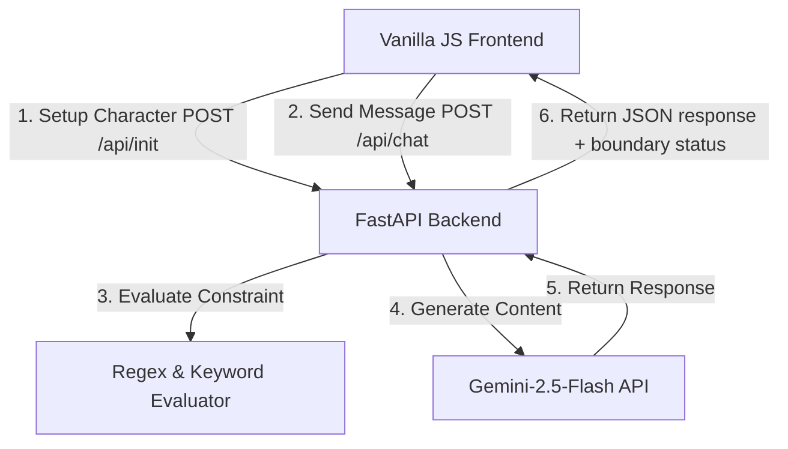

# AI Character Chat — Engineering Design Doc

**Author:** Eng Team
**Status:** Draft v0.1
**Last updated:** 2026-07-19
**Reviewers:** PM Team, UX Team

---

## 1. Summary

We are building a single-page web application featuring a Python FastAPI backend and a vanilla HTML/CSS/JS frontend. The application allows users to define a custom AI character and have a 5-turn chat session with it. The core technical mechanism is the reliable injection of negative constraints (the "forbidden phrase") into the Gemini LLM system instructions, and the runtime evaluation of the character's adherence to this restriction.

## 2. Assumptions

- **Target scale:** <1,000 DAU during v1.
- **Latency budget:** p95 <4s for LLM generation response.
- **Platform:** Desktop and Mobile Web (responsive design).
- **Cost ceiling:** <$0.02 per user interaction (5 turns).
- **Out of scope:** User authentication, remote chat persistence database, complex conversation branching, avatar image hosting.

## 3. Goals & non-goals

**Goals (v1):**
- Expose a FastAPI REST API for initializing a character session and sending message turns.
- Integrate the `google-genai` Python SDK to communicate with `gemini-2.5-flash`.
- Ensure the character respects the defined personality and never outputs the user-specified forbidden phrase or theme.
- Support exactly 5 turns of conversation per session.
- Expose a React-like reactive UI built with vanilla JS and CSS.

**Non-goals (v1):**
- Multi-user rooms or real-time WebSockets (polling/simple HTTP requests are sufficient).
- State persistence across different browser sessions/devices.
- Voice/speech integration.

## 4. Architecture



**What's here:**
- **FastAPI Application Server:** Hosts static frontend assets and provides the API endpoints.
- **Gemini Client Wrapper:** Manages system instructions, prompt injection, and generation config.
- **State Evaluator:** Simple internal module checking if the forbidden phrase was nearly generated or if the user actively baited the rule.

**What's deliberately NOT here:**
- **No external DB / Redis:** The session history is passed back and forth between client and server or kept temporarily in memory.
- **No authentication system:** Saves development overhead; sessions are private to the local browser window.

## 5. Key components

### FastAPI Web Server
- **Responsibility:** Serves static frontend files and exposes endpoints for character initialization and chat.
- **Tech choice:** FastAPI & Uvicorn.
- **Why this choice:** Extremely low boilerplate, matches the patterns in `reference/moodjar-example/`.
- **Interface:** Exposes `POST /api/init`, `POST /api/chat`, and `GET /api/health`.

### Gemini AI Interface
- **Responsibility:** Formulates prompts containing personality constraints and forbidden concepts, making generation requests.
- **Tech choice:** `google-genai` Python SDK.
- **Why this choice:** Standard official SDK for Gemini.
- **Interface:** `generate_character_response(name, personality, forbidden, history)` returning text and boundary verification status.

### Frontend App Engine (`app.js`)
- **Responsibility:** Manages page transition animations, message history representation, API network request state, and CSS class animations.
- **Tech choice:** Vanilla JS with CSS transitions.
- **Why this choice:** Lightweight, zero bundle/compilation requirements, high performance for simple interactive tasks.

## 6. Data model

```typescript
type CharacterDefinition = {
  name: string;
  personality: string;
  forbidden: string;
};

type ChatMessage = {
  role: "user" | "model";
  text: string;
};

type ChatSession = {
  character: CharacterDefinition;
  turns: ChatMessage[];
};
```

**Notes:**
- No database tables are defined.
- State is held in the frontend JS runtime memory (`app.js` state object).

## 7. API surface

### `POST /api/init`
Initialize the session.
- **Input:**
  ```json
  {
    "name": "Grumpy Wizard",
    "personality": "A tired, sarcastic wizard living in a tower.",
    "forbidden": "please"
  }
  ```
- **Output:**
  ```json
  {
    "status": "initialized",
    "message": "The wizard awakens..."
  }
  ```

### `POST /api/chat`
Send user message and get bot response.
- **Input:**
  ```json
  {
    "name": "Grumpy Wizard",
    "personality": "A tired, sarcastic wizard living in a tower.",
    "forbidden": "please",
    "history": [
      {"role": "user", "text": "Can you open the door?"},
      {"role": "model", "text": "No. Go away."}
    ],
    "message": "Do it now, please?"
  }
  ```
- **Output:**
  ```json
  {
    "text": "I said no, and I don't care how nicely you ask.",
    "boundary_tested": true
  }
  ```

## 8. Key trade-offs

### Decision: Stateless Backend Server
- **Chose:** Frontend sends the entire history on each `POST /api/chat` call.
- **Considered:** Server-side sessions (e.g. SQLite, redis, or global dict).
- **Why we picked this:** Keeps the backend completely stateless, avoiding memory leaks on a free-tier hosting instance, and makes scaling/restarts trivial. The context size (5 turns) is so small (~1k tokens max) that the cost of transmitting the history is negligible.

### Decision: Strict local parsing for "never say" compliance
- **Chose:** Standard Python string matching / regex checking in addition to system instructions.
- **Considered:** Asking Gemini to self-evaluate.
- **Why we picked this:** System prompts are occasionally bypassed by adversarial prompt injection. Double-checking the LLM's output against the exact forbidden string before returning it to the client ensures 100% compliance with the contract, allowing us to override the response if the LLM hallucinated the forbidden word.

## 9. Risks & unknowns

- **Risk:** Gemini generates the forbidden word anyway.
  - *Mitigation:* The backend will intercept the generated message. If it contains the forbidden string (or derivatives), it will force a regeneration or fallback deflection (e.g., "*mutters inaudibly to avoid saying the word*").
- **Risk:** Gemini latency exceeds 5 seconds.
  - *Mitigation:* Add a loading ripple indicator to the UI and timeout requests gracefully at 6 seconds with a user-facing retry button.

## 10. Testing strategy

### Unit tests (Python / pytest)
- **`test_validate_forbidden_constraint`** in `tests/test_evaluator.py`:
  - Input: LLM response string containing "please", Forbidden term: "please".
  - Expected output: `True` (boundary breached).
  - Input: LLM response: "I cannot do that.", Forbidden term: "please".
  - Expected output: `False` (boundary safe).
- **`test_dynamic_prompt_generator`** in `tests/test_prompts.py`:
  - Test that the prompt injection code properly places the character's name, personality, and forbidden constraint into the final system instruction string.

### Integration tests (pytest + HTTP Client)
- **Character Conversation Happy Path Flow**:
  1. Call `POST /api/init` with mock character config.
  2. Call `POST /api/chat` with user input.
  3. Validate HTTP status 200, output format matches schema, and `boundary_tested` is a boolean.

### Deliberately not tested (and why):
- **Visual styling and transitions** — verified manually in browser view.
- **Internal Gemini API calls** — mocked during test runs to avoid network dependency and API cost charges.

## 11. Rollout & monitoring

- **Rollout:** Deploy code directly to local port 8000 for testing, then deploy to a cloud instance (e.g. Render or Hugging Face Spaces).
- **Monitoring:** Log occurrences of forbidden word detections in python stdout to track prompt bypass rates.

## 12. Cost & capacity

- **Model pricing:** `gemini-2.5-flash` costs $0.075 / 1M input tokens.
- **Turn calculation:**
  - 5-turn session consumes ~4,000 input tokens cumulative.
  - Cost per full chat session is ~$0.0003, well within our cost ceiling of $0.02.

## 13. Open questions

- [ ] Should the forbidden constraint check be strictly case-insensitive? (Yes, default to case-insensitive).
- [ ] If a user enters multiple forbidden words, should we support it or reject? (Reject: single phrase/word only for v1).

## 14. Out of scope

- Multi-character interactions.
- Session sharing via link generation.
